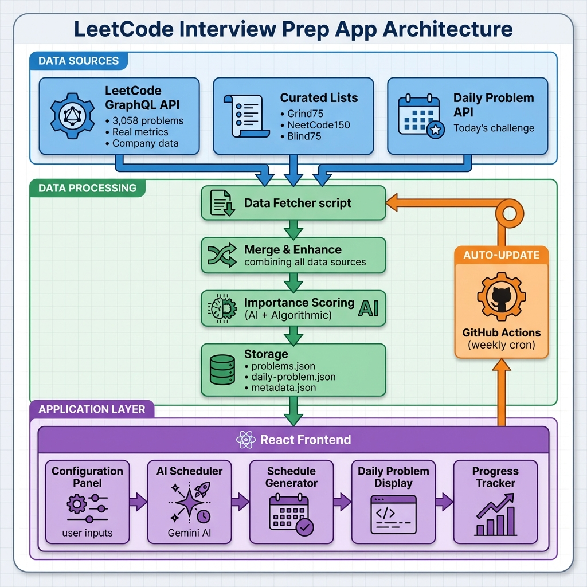

# 🎯 Smart Interview Grind - AI-Powered LeetCode Scheduler

**Your intelligent, personalized interview preparation companion powered by AI and real-time data.**

🌐 **[Live Demo](https://Mohit-R-04.github.io/Smart-InterviewPrep/)** | 📖 [Documentation](#architecture) | ⭐ [Star this repo](https://github.com/Mohit-R-04/Smart-InterviewPrep)

---

## ✨ Features

### 🤖 **AI-Powered Scheduling**
- Gemini AI generates intelligent, personalized study schedules
- No duplicate problems guaranteed
- Progressive difficulty (Easy → Hard week-over-week)
- Curated problem prioritization

### 📊 **Real-Time Data**
- **3,058 LeetCode problems** with actual metrics
- **Real submission counts** (solved by X people)
- **Actual likes/dislikes** from LeetCode
- **Company-specific questions** from 15+ top tech companies
- **Daily LeetCode problem** displayed beautifully

### 📚 **Multiple Curated Sheets**
- **Grind75** (75 problems)
- **NeetCode150** (150 problems)
- **Blind75** (76 problems)
- **170 unique curated problems** (duplicates removed)

### 🏢 **Company Targeting**
- Google, Amazon, Microsoft, Meta, Apple
- Bloomberg, Adobe, Uber, Airbnb, LinkedIn
- Tesla, Twitter, Snapchat, TikTok, Netflix
- **Real frequency data** (how recently asked)

### 🔄 **Weekly Auto-Updates**
- GitHub Actions workflow
- Updates every Sunday automatically
- Fresh company questions
- Latest daily problems

---

## 🏗️ Architecture



### **Data Flow:**

1. **Data Sources** (Blue)
   - LeetCode GraphQL API fetches 3,058 problems with real metrics
   - Curated lists (Grind75, NeetCode150, Blind75) provide expert selections
   - Daily Problem API gets today's LeetCode challenge

2. **Data Processing** (Green)
   - Data Fetcher script collects from all sources
   - Merge & Enhance combines and enriches data
   - Importance Scoring uses AI + algorithmic methods
   - Storage saves to JSON files (problems.json, daily-problem.json, metadata.json)

3. **Application Layer** (Purple)
   - React Frontend displays the UI
   - Configuration Panel captures user preferences
   - AI Scheduler (Gemini) generates personalized schedules
   - Schedule Generator creates week-by-week plans
   - Daily Problem Display shows today's challenge
   - Progress Tracker monitors completion

4. **Auto-Update** (Orange)
   - GitHub Actions runs weekly (every Sunday)
   - Automatically triggers Data Fetcher
   - Keeps data fresh without manual intervention

---

## 🚀 Quick Start

### **1. Install Dependencies**
```bash
npm install
```

### **2. Fetch Real-Time Data**
```bash
npm run fetch-realtime
```
This fetches 3,058 problems with real metrics (~5-10 minutes)

### **3. Start the App**
```bash
npm run dev
```

### **4. Open in Browser**
Navigate to `http://localhost:5173/`

---

## 📋 How It Works

### **1. Configure Your Profile**
- **Experience Level**: Beginner / Intermediate / Expert
- **Duration**: Number of weeks
- **Weekly Hours**: Time available per week
- **Difficulty**: Select Easy, Medium, Hard
- **Companies**: Target specific companies
- **Topics**: Focus on specific patterns

### **2. AI Generates Your Schedule**
- Analyzes your profile and goals
- Selects best problems from 3,058 options
- Ensures no duplicates
- Progressive difficulty
- Curated problems first

### **3. Track Your Progress**
- Mark problems as completed
- See completion percentage
- Track remaining time
- Visual progress indicators

---

## 🎯 AI Scheduling

The app uses **Gemini AI** to generate intelligent schedules:

### **Input:**
- Your profile (experience, time, goals)
- 3,058 problems with importance scores
- Company-specific data
- Curated problem lists

### **Output:**
- Personalized week-by-week schedule
- Exact problem count matching your time
- No duplicate problems
- Progressive difficulty
- Strategic topic coverage

### **Fallback:**
If AI is unavailable, uses proven algorithmic scheduler with:
- Topic diversity penalties
- Difficulty progression
- Company frequency weighting
- Grind75 prioritization

---

## 📊 Data Sources

### **LeetCode API**
- 3,058 free problems
- Real submission counts
- Actual likes/dislikes
- Acceptance rates
- Topic tags

### **Company Data**
- 15+ companies tracked
- Real frequency metrics
- Recently asked questions
- Company-specific patterns

### **Curated Lists**
- Grind75 (expert-curated)
- NeetCode150 (popular patterns)
- Blind75 (classic problems)

---

## 🔄 Updating Data

### **Manual Update**
```bash
npm run fetch-realtime
```

### **Automatic Updates**
- GitHub Actions runs every Sunday
- Updates all data automatically
- No manual intervention needed

---

## 📁 Project Structure

```
smart-interview-grind/
├── src/
│   ├── components/
│   │   ├── DailyProblem.jsx       # Daily LeetCode challenge
│   │   ├── ConfigurationPanel.jsx  # User preferences
│   │   ├── ScheduleView.jsx        # Weekly schedule display
│   │   └── ...
│   ├── utils/
│   │   ├── aiScheduler.js          # Gemini AI scheduling
│   │   └── scheduler.js            # Algorithmic fallback
│   └── App.jsx
├── scripts/
│   ├── fetch_realtime_data.js      # Real-time data fetcher
│   ├── merge_curated_sheets.js     # Combine Grind75/NeetCode/Blind75
│   └── scrape_leetcode_data.js     # LeetCode API scraper
├── public/
│   ├── problems.json               # 3,058 problems with metrics
│   ├── daily-problem.json          # Today's daily problem
│   └── metadata.json               # Last updated timestamp
└── .github/workflows/
    └── weekly-update.yml           # Auto-update workflow
```

---

## 🎓 Commands

```bash
# Development
npm run dev                    # Start development server
npm run build                  # Build for production
npm run preview                # Preview production build

# Data Management
npm run fetch-realtime         # Fetch real-time LeetCode data
node scripts/merge_curated_sheets.js  # Merge curated sheets

# Deployment
npm run deploy                 # Deploy to GitHub Pages
```

---

## 🌟 Key Highlights

### **Real Metrics**
- ✅ Actual submission counts (not estimated)
- ✅ Real likes/dislikes from LeetCode
- ✅ Company frequency from LeetCode API
- ✅ Accurate importance scores

### **AI Intelligence**
- ✅ Gemini AI-powered scheduling
- ✅ Personalized to YOUR profile
- ✅ No duplicate problems
- ✅ Strategic problem selection

### **Curated Quality**
- ✅ 170 expert-curated problems
- ✅ Grind75 + NeetCode150 + Blind75
- ✅ Duplicates removed
- ✅ Priority in scheduling

### **Always Fresh**
- ✅ Weekly auto-updates
- ✅ Latest company questions
- ✅ Daily LeetCode problem
- ✅ Real-time metrics

---

## 💡 Pro Tips

### **1. Update Data Regularly**
```bash
npm run fetch-realtime  # Weekly recommended
```

### **2. Trust the Curated Problems**
- Grind75, NeetCode150, Blind75 are expert-selected
- These appear first in your schedule
- Proven to be most valuable

### **3. Use Company Targeting**
- Select your target companies
- AI focuses on their specific questions
- Real frequency data shows what's recent

### **4. Follow the Schedule**
- Progressive difficulty is intentional
- Week 1: Build confidence with easier problems
- Week 4: Challenge yourself with harder problems

---

## 🎊 What Makes This Special

### **vs Manual Prep:**
- ❌ Random problem selection → ✅ AI-curated schedule
- ❌ Guessing what's important → ✅ Real importance scores
- ❌ Outdated data → ✅ Weekly auto-updates
- ❌ Duplicate practice → ✅ No duplicates guaranteed

### **vs Other Tools:**
- ✅ **3,058 problems** (most comprehensive)
- ✅ **Real metrics** (not estimates)
- ✅ **AI scheduling** (personalized)
- ✅ **Auto-updates** (always fresh)
- ✅ **Multiple curated sheets** (Grind75 + NeetCode + Blind75)

---

## 📝 License

Open-source and free to use.

---

## 🙏 Acknowledgments

- **LeetCode** for the comprehensive problem database
- **Grind75** for the curated problem list
- **NeetCode** for the 150 essential problems
- **Blind** for the classic 75 problems
- **Google Gemini** for AI-powered scheduling

---

## 🎯 Start Grinding Smarter!

```bash
npm install
npm run fetch-realtime
npm run dev
```

**Happy Grinding! 🚀**
