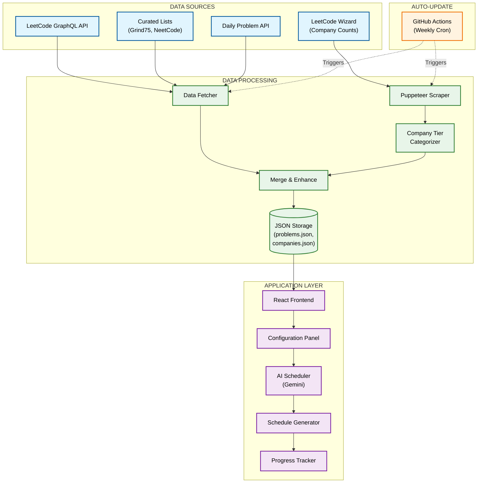

# System Architecture

## Component Description

### 1. Data Sources (Blue)
- **LeetCode GraphQL API**: Fetches detailed metrics for 3,058 problems.
- **LeetCode Wizard**: Provides accurate company problem counts using Puppeteer.
- **Curated Lists**: Expert-selected problem lists (Grind75, NeetCode150).
- **Daily Problem API**: Retrieves the daily challenge.

### 2. Data Processing (Green)
- **Data Fetcher**: Orchestrates the data collection from multiple sources.
- **Puppeteer Scraper**: Handles dynamic content extraction for company data.
- **Company Tier Categorizer**: Organizes 664 companies into 7 priority tiers.
- **Merge & Enhance**: Combines all data, ensures consistency, and adds importance scores.
- **Storage**: Static JSON files that drive the frontend (fast, cheap, reliable).

### 3. Application Layer (Purple)
- **React Frontend**: The main user interface.
- **AI Scheduler**: Uses Google Gemini to generate personalized paths.
- **Progress Tracker**: Persists user progress and celebrates milestones.

### 4. Auto-Update (Orange)
- **GitHub Actions**: Runs every Sunday at 00:00 UTC to keep data fresh.
